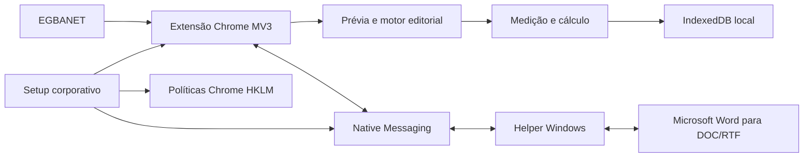

<div align="center">

# Régua Editorial SieDOE

### Municípios à Vista

**Ferramenta corporativa de apoio à preparação, medição, cálculo e consulta de publicações do Caderno Municípios no EGBANET.**

[Release 1.0.1](https://github.com/guedesle/regua-municipios-a-vista/releases/tag/v1.0.1-pilot.1) · [Instalar](docs/01-GUIA-DE-INSTALACAO.md) · [Implantar em AD/GPO](docs/12-DISTRIBUICAO-CORPORATIVA-AD-GPO.md) · [Referência técnica](docs/09-REFERENCIA-TECNICA.md) · [Usar](docs/08-GUIA-RAPIDO-DE-USO.md)

</div>

---

A Régua Editorial acompanha o usuário no tratamento de matérias do Caderno Municípios no EGBANET. A solução prepara o documento conforme as regras editoriais homologadas, exibe prévia, mede tarja e conteúdo, calcula o valor da publicação, registra o cálculo localmente e permite consultas e relatórios.

> [!IMPORTANT]
> Esta é uma **pré-release de piloto interno da EGBA**. O repositório de distribuição é privado e não deve ser tratado como canal público de software.

## Instaladores da Entrega 1.0.1

A Release `v1.0.1-pilot.1` possui dois instaladores com finalidade distinta.

### Corporativo — estações do domínio

```text
ReguaEditorial-Entrega1-Corporativo-x64.exe
ReguaEditorial-Entrega1-Corporativo-x64.exe.sha256
```

Use em estações Windows x64 vinculadas ao Active Directory da organização. Nesta entrega o gate corporativo exige:

```text
Win32_ComputerSystem.PartOfDomain = True
```

### Homologação local — laboratório fora do domínio

```text
ReguaEditorial-Entrega1-HomologacaoLocal-x64.exe
ReguaEditorial-Entrega1-HomologacaoLocal-x64.exe.sha256
```

Use somente para homologação técnica em estação fora do domínio. Esse artefato ignora exclusivamente o gate de gerenciamento corporativo/AD. Permanecem ativos os controles de integridade, assinatura, versão, arquitetura, Native Helper e aplicação das políticas da extensão.

> [!WARNING]
> O instalador **HomologacaoLocal** não deve ser usado como substituto do instalador **Corporativo** em implantação institucional.

## Instalação rápida

1. Acesse a [Release `v1.0.1-pilot.1`](https://github.com/guedesle/regua-municipios-a-vista/releases/tag/v1.0.1-pilot.1).
2. Escolha o instalador adequado à estação e baixe também o `.sha256` de mesmo nome.
3. [Valide o SHA-256](docs/01-GUIA-DE-INSTALACAO.md#3-validar-a-integridade).
4. Feche completamente o Google Chrome.
5. Execute o `.exe` como administrador.
6. Reabra o Chrome e valide `chrome://policy` e `chrome://extensions`.
7. Execute a homologação funcional mínima.

A estação operacional precisa de Windows x64 e Google Chrome. O Microsoft Word desktop é necessário somente para conversão automática de DOC e RTF. O Helper é self-contained; não é necessário instalar separadamente o .NET Runtime.

## Identificação técnica atual

| Item | Valor |
|---|---|
| Release | `v1.0.1-pilot.1` |
| Canal | `pilot` |
| Instalador | `1.0.1` |
| Extensão Chrome | `0.7.4` |
| Regras editoriais | `municipios-editorial-rules@1.3.0` |
| Native Helper | `0.1.4` |
| Contrato Native Messaging | `1.2.0` |
| IndexedDB / schema de registros | `3` |
| Extension ID | `chdfbekdjpecdajbpdelmhpemenoelmd` |
| Native host | `com.egba.regua_editorial.helper` |
| Manifest | Chrome Manifest V3 |

A identidade `chdfbekdjpecdajbpdelmhpemenoelmd` é a identidade operacional definitiva desta linha de distribuição. A chave privada correspondente deve permanecer fora deste repositório e ser reutilizada em todas as atualizações da mesma extensão.

## Como a solução funciona



A extensão possui acesso de host restrito a `https://egbanet.egba.ba.gov.br/*` e injeta content script apenas nas páginas de matéria `edit/*` e `edicao_restrita/*`. O programa auxiliar aceita comunicação somente da origem `chrome-extension://chdfbekdjpecdajbpdelmhpemenoelmd/`.

## Dados e privacidade

Os cálculos são persistidos no IndexedDB do perfil do Chrome. A Entrega 1 não depende de banco externo nem persiste o conteúdo dos documentos processados.

Cuidados operacionais:

- utilizar sempre o mesmo perfil do Chrome;
- não limpar dados do navegador sem procedimento de preservação;
- não remover a extensão sem avaliar o impacto no IndexedDB;
- exportar CSV/JSON conforme a rotina operacional;
- não compartilhar documentos de produção em issues ou evidências técnicas.

## Documentação por público e tarefa

| Necessidade | Documento |
|---|---|
| instalar uma estação | [01 — Guia de instalação](docs/01-GUIA-DE-INSTALACAO.md) |
| homologar o pacote | [02 — Guia de homologação](docs/02-GUIA-DE-HOMOLOGACAO.md) |
| atender ocorrências | [03 — Operação e suporte](docs/03-OPERACAO-E-SUPORTE.md) |
| reverter ou conter uma versão | [04 — Plano de rollback](docs/04-PLANO-DE-ROLLBACK.md) |
| entender o empacotamento | [05 — Arquitetura de distribuição](docs/05-ARQUITETURA-DE-DISTRIBUICAO.md) |
| conferir a prontidão | [06 — Checklist de entrega](docs/06-CHECKLIST-DE-ENTREGA.md) |
| auditar versões e ativos | [07 — Inventário da Release](docs/07-INVENTARIO-DA-RELEASE.md) |
| orientar operadores | [08 — Guia rápido de uso](docs/08-GUIA-RAPIDO-DE-USO.md) |
| diagnosticar tecnicamente | [09 — Referência técnica](docs/09-REFERENCIA-TECNICA.md) |
| consultar QA documental | [10 — Relatório de QA](docs/10-RELATORIO-QA-DOCUMENTACAO.md) |
| entender a extensão MV3 e suas permissões | [11 — Especificação técnica da extensão](docs/11-ESPECIFICACAO-TECNICA-EXTENSAO.md) |
| distribuir via AD/GPO | [12 — Distribuição corporativa AD/GPO](docs/12-DISTRIBUICAO-CORPORATIVA-AD-GPO.md) |
| planejar atualização e continuidade | [13 — Atualização e continuidade](docs/13-ATUALIZACAO-E-CONTINUIDADE.md) |
| segurança da distribuição | [SECURITY.md](SECURITY.md) |

## Políticas e caminhos principais

Políticas Chrome:

```text
HKLM\SOFTWARE\Policies\Google\Chrome\ExtensionInstallForcelist
HKLM\SOFTWARE\Policies\Google\Chrome\NativeMessagingAllowlist
HKLM\SOFTWARE\Policies\Google\Chrome\ExtensionSettings
```

Native Messaging:

```text
HKLM\Software\Google\Chrome\NativeMessagingHosts\com.egba.regua_editorial.helper
```

Arquivos e estado:

```text
%ProgramFiles%\EGBA\ReguaEditorial\
%ProgramFiles%\EGBA\ReguaEditorialHelper\
%ProgramData%\EGBA\ReguaEditorial\extension-cache\
%ProgramData%\EGBA\ReguaEditorial\state\
%ProgramData%\EGBA\ReguaEditorial\Logs\
```

## Assinatura do piloto

Os instaladores do piloto utilizam certificado temporário de laboratório. O primeiro UAC pode apresentar **Editor desconhecido** até que o certificado público do pacote esteja confiado na estação.

Antes da execução:

- valide o SHA-256;
- confirme a origem na Release privada oficial;
- confirme o nome do instalador;
- nunca distribua a PEM da extensão ou chave privada de assinatura.

A promoção ao canal `stable` depende de assinatura corporativa reconhecida e nova homologação da cadeia de distribuição.

## Sobre este repositório

Este repositório contém **distribuição**, não desenvolvimento: instaladores publicados como ativos de Releases, hashes, notas de entrega, documentação para TI/operação e scripts de publicação. Código-fonte, testes, chaves e diretórios intermediários de build permanecem fora daqui.

---

<div align="center">

**Empresa Gráfica da Bahia — EGBA**  
Distribuição interna da Régua Editorial SieDOE

</div>
