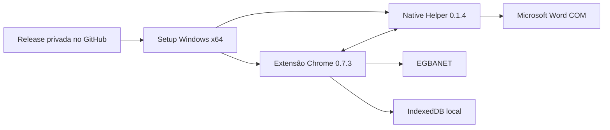

<div align="center">

# Régua Editorial SieDOE

### Municípios à Vista

**Distribuição corporativa da Entrega 1 para o fluxo editorial do Caderno Municípios**

[Baixar versão piloto](https://github.com/guedesle/regua-municipios-a-vista/releases/tag/v1.0.0-pilot.1) · [Instalação](docs/01-GUIA-DE-INSTALACAO.md) · [Homologação](docs/02-GUIA-DE-HOMOLOGACAO.md) · [Suporte](docs/03-OPERACAO-E-SUPORTE.md)

</div>

---

> [!IMPORTANT]
> Este é um repositório **privado de distribuição, documentação operacional e homologação**. O código-fonte, os testes e o pipeline de build permanecem no repositório de desenvolvimento `guedesle/calculadora-editorial`.

## Visão geral

A **Régua Editorial SieDOE** é uma solução local para apoio ao processamento, à padronização, à medição e ao cálculo de publicações do Caderno Municípios no EGBANET.

A Entrega 1 reúne, em um único instalador Windows, a extensão Chrome operacional, o Native Helper autocontido e os componentes administrativos necessários para instalação controlada em estações corporativas da EGBA.

## Estado da entrega

| Item | Valor |
|---|---|
| Situação | Disponível para piloto e homologação corporativa |
| Release | `v1.0.0-pilot.1` |
| Canal | `pilot` |
| Setup Windows | `1.0.0` |
| Extensão Chrome | `0.7.3` |
| Native Helper | `0.1.4` |
| Contrato Native Messaging | `1.2.0` |
| IndexedDB / schema | `3` |
| Extension ID | `chdfbekdjpecdajbpdelmhpemenoelmd` |
| Native host | `com.egba.regua_editorial.helper` |

> [!NOTE]
> Esta distribuição é temporária e restrita à equipe autorizada. Ela não deve ser tratada como publicação pública, instalador de uso geral ou substituto do repositório de desenvolvimento.

## Obter o pacote

A instalação deve ser feita exclusivamente com os ativos disponibilizados na Release privada:

- `ReguaEditorial-Entrega1-Setup-x64.exe`
- `ReguaEditorial-Entrega1-Setup-x64.exe.sha256`

**Acesso:** [Release v1.0.0-pilot.1](https://github.com/guedesle/regua-municipios-a-vista/releases/tag/v1.0.0-pilot.1)

Não é necessário baixar o código do repositório para instalar a solução.

### Verificar a integridade

No PowerShell, na pasta em que os dois arquivos foram baixados:

```powershell
$Setup = ".\ReguaEditorial-Entrega1-Setup-x64.exe"
$HashFile = ".\ReguaEditorial-Entrega1-Setup-x64.exe.sha256"

$Actual = (Get-FileHash $Setup -Algorithm SHA256).Hash.ToLowerInvariant()
$Expected = ((Get-Content $HashFile -Raw).Trim() -split "\s+")[0].ToLowerInvariant()

if ($Actual -ne $Expected) {
    throw "HASH_DIVERGENTE: expected=$Expected actual=$Actual"
}

Write-Host "Integridade confirmada: $Actual"
```

> [!WARNING]
> Não execute o instalador quando o hash divergir, quando o arquivo tiver sido renomeado ou quando tiver sido recebido fora da Release oficial.

## Requisitos da estação

| Requisito | Condição |
|---|---|
| Sistema operacional | Windows x64 suportado pela empresa |
| Navegador | Google Chrome |
| Gerenciamento | Estação associada ao Active Directory |
| Instalação | Credencial administrativa durante a implantação |
| Operação | Usuário padrão após a instalação |
| Microsoft Word | Necessário para conversão automática de DOC e RTF |
| Internet pública | Não exigida para a instalação standalone |
| .NET Runtime | Não exigido previamente; o Helper é autocontido |

## Instalação rápida

1. Baixe o `.exe` e o `.sha256` na Release oficial.
2. Confirme o SHA-256 do instalador.
3. Feche completamente o Google Chrome.
4. Execute o Setup como administrador.
5. Reabra o Chrome e valide a instalação em `chrome://policy` e `chrome://extensions`.
6. Execute os casos mínimos do [Guia de homologação](docs/02-GUIA-DE-HOMOLOGACAO.md).

O procedimento completo, incluindo pré-checks, evidências e tratamento de falhas, está no [Guia de instalação](docs/01-GUIA-DE-INSTALACAO.md).

## Escopo funcional da Entrega 1

A versão distribuída contempla:

- leitura dos dados da matéria no EGBANET;
- processamento direto de DOCX;
- conversão automática de DOC e RTF por Microsoft Word COM;
- aplicação das regras editoriais homologadas;
- geração de prévia, medição e cálculo financeiro;
- persistência local dos cálculos em IndexedDB;
- recuperação e reprocessamento controlado;
- relatórios por data ou intervalo;
- filtros por protocolo e cliente;
- exportação JSON e CSV.

## Arquitetura da distribuição



O Setup incorpora os componentes necessários à primeira instalação. A chave privada PEM usada para assinar a extensão não faz parte do pacote nem deste repositório.

## Documentação operacional

| Documento | Público principal | Finalidade |
|---|---|---|
| [Guia de instalação](docs/01-GUIA-DE-INSTALACAO.md) | TI e técnico instalador | Preparar, instalar e validar a estação |
| [Guia de homologação](docs/02-GUIA-DE-HOMOLOGACAO.md) | GERDO, TI e operadores | Executar os casos de aceite |
| [Operação e suporte](docs/03-OPERACAO-E-SUPORTE.md) | Operação e suporte | Classificar ocorrências e coletar evidências |
| [Plano de rollback](docs/04-PLANO-DE-ROLLBACK.md) | TI e responsáveis pela liberação | Reverter componentes sem perda indevida de dados |
| [Arquitetura de distribuição](docs/05-ARQUITETURA-DE-DISTRIBUICAO.md) | TI e desenvolvimento | Entender componentes, limites e dependências |
| [Checklist de entrega](docs/06-CHECKLIST-DE-ENTREGA.md) | Responsáveis pela release | Verificar prontidão e aceite |
| [Inventário da release](docs/07-INVENTARIO-DA-RELEASE.md) | Auditoria e suporte | Registrar versões, identidade e integridade |

## Segurança e privacidade

- a chave PEM operacional permanece fora do repositório e das Releases;
- documentos de produção, conteúdo de matérias e arquivos convertidos não devem ser anexados aqui;
- cookies, tokens, credenciais e dados de autenticação são proibidos em issues, commits e logs;
- evidências técnicas devem ser sanitizadas;
- a extensão e o Setup devem ser distribuídos apenas a usuários autorizados;
- remoções que possam afetar o IndexedDB exigem procedimento controlado.

Consulte a [Política de segurança](SECURITY.md) antes de registrar incidentes ou compartilhar evidências.

## Limites deste repositório

### Este repositório contém

- Releases oficiais para consumo interno;
- documentação de instalação e homologação;
- inventários e notas de entrega;
- scripts administrativos de publicação da Release.

### Este repositório não contém

- código-fonte da extensão ou do Helper;
- histórico de desenvolvimento;
- dependências de build;
- chaves privadas ou credenciais;
- documentos e dados operacionais do EGBANET.

## Responsabilidades

| Papel | Responsabilidade principal |
|---|---|
| GERDO | Escopo, regras de negócio, homologação funcional e aceite |
| GERINF / TI | Instalação, políticas, estações, suporte técnico e rollback |
| Desenvolvimento | Build reproduzível, correções, versões e documentação técnica |
| Operador | Uso conforme o fluxo homologado e registro adequado de ocorrências |

---

<div align="center">

**Empresa Gráfica da Bahia — EGBA**  
Distribuição interna da Régua Editorial SieDOE

</div>
