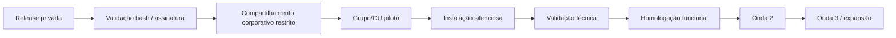

# Distribuição corporativa por Active Directory / GPO

Este documento orienta a equipe de TI na implantação da Régua Editorial SieDOE em estações Windows ingressadas no domínio.

## 1. Escopo desta Release

Artefato institucional:

```text
ReguaEditorial-Entrega1-Corporativo-x64.exe
```

A Entrega 1.0.1 exige:

```text
Windows x64
Google Chrome
PartOfDomain = True
privilégio administrativo durante a instalação
```

Microsoft Word desktop é necessário somente nas estações que processam DOC/RTF.

O instalador de homologação local não deve ser distribuído por GPO como pacote institucional.

## 2. Modelo recomendado de rollout



Não faça implantação ampla antes da homologação de um grupo representativo.

## 3. Estrutura de grupos sugerida

Exemplo conceitual:

```text
GG-REGUA-EDITORIAL-PILOTO
GG-REGUA-EDITORIAL-PRODUCAO
GG-REGUA-EDITORIAL-BLOQUEADO
```

A nomenclatura real deve seguir o padrão da GERINF/AD.

Benefícios:

- escopo explícito;
- rollout em ondas;
- retirada rápida do alvo de implantação;
- inventário de estações autorizadas;
- separação entre piloto e produção.

## 4. Distribuição do binário

Mantenha o instalador em compartilhamento de software com acesso somente a administradores/computadores autorizados.

Exemplo:

```text
\\servidor\software$\ReguaEditorial\v1.0.1-pilot.1\
    ReguaEditorial-Entrega1-Corporativo-x64.exe
    ReguaEditorial-Entrega1-Corporativo-x64.exe.sha256
```

Não armazene no compartilhamento:

- PEM da extensão;
- PFX/chaves privadas;
- source code;
- documentos de teste reais;
- credenciais.

## 5. Por que copiar para disco local

Para reduzir falhas de rede durante instalação e simplificar diagnóstico, o script de implantação deve:

1. criar um diretório local de staging;
2. copiar `.exe` e `.sha256`;
3. validar o hash local;
4. executar o Setup localmente;
5. registrar código de saída;
6. preservar log administrativo.

Exemplo de staging:

```text
C:\ProgramData\EGBA\ReguaEditorial\deploy\1.0.1\
```

## 6. Instalação silenciosa

O Setup é NSIS e suporta modo silencioso `/S`.

Exemplo:

```powershell
$Setup = 'C:\ProgramData\EGBA\ReguaEditorial\deploy\1.0.1\ReguaEditorial-Entrega1-Corporativo-x64.exe'

$Process = Start-Process `
  -FilePath $Setup `
  -ArgumentList '/S' `
  -Wait `
  -PassThru

if ($Process.ExitCode -ne 0) {
  throw "REGUA_SETUP_EXIT_CODE:$($Process.ExitCode)"
}
```

Teste o modo silencioso em laboratório antes da implantação por GPO.

## 7. GPO — Startup Script

Para um `.exe` NSIS, o caminho mais simples no Active Directory é usar **Computer Configuration > Windows Settings > Scripts > Startup** ou mecanismo equivalente de execução como máquina.

Fluxo recomendado do script:

```text
startup como SYSTEM
→ verificar PartOfDomain
→ verificar versão instalada
→ copiar arquivos do compartilhamento
→ validar SHA-256
→ fechar/aguardar Chrome conforme política operacional
→ executar Setup /S
→ validar installation.json
→ registrar resultado
```

O processo deve ser idempotente: se a versão correta já estiver instalada e saudável, não reinstalar sem motivo.

## 8. Validação do domínio

```powershell
$Computer = Get-CimInstance Win32_ComputerSystem
if (-not $Computer.PartOfDomain) {
    throw 'ACTIVE_DIRECTORY_REQUIRED'
}
```

Não use o instalador de homologação local para contornar esse requisito em estações de produção.

## 9. Detectar versão instalada

Registro do produto:

```text
HKLM\Software\EGBA\ReguaEditorial
```

Verificação:

```powershell
Get-ItemProperty 'HKLM:\Software\EGBA\ReguaEditorial' -ErrorAction SilentlyContinue |
  Select-Object Version, Channel, InstallLocation, UpdateUrl
```

Versão esperada:

```text
1.0.1
```

## 10. Validação pós-instalação automatizável

```powershell
$Checks = [ordered]@{
  Helper = Test-Path "$env:ProgramFiles\EGBA\ReguaEditorialHelper\ReguaEditorial.Helper.exe"
  InstallationState = Test-Path "$env:ProgramData\EGBA\ReguaEditorial\state\installation.json"
  ChromePolicyState = Test-Path "$env:ProgramData\EGBA\ReguaEditorial\state\chrome-policy.json"
}

$Checks

if ($Checks.Values -contains $false) {
  throw 'REGUA_POST_INSTALL_VALIDATION_FAILED'
}
```

## 11. Validar o Helper

```powershell
$Helper = "$env:ProgramFiles\EGBA\ReguaEditorialHelper\ReguaEditorial.Helper.exe"
$Probe = & $Helper --probe --workspace "$env:TEMP"
if ($LASTEXITCODE -ne 0) {
    throw 'HELPER_PROBE_FAILED'
}
$Probe
```

Esperado:

```text
helperVersion = 0.1.4
contractVersion = 1.2.0
workspaceWritable = true
available = true
```

## 12. Políticas Chrome — modelo atual

O próprio Setup grava políticas locais HKLM:

```text
HKLM\SOFTWARE\Policies\Google\Chrome\ExtensionInstallForcelist
HKLM\SOFTWARE\Policies\Google\Chrome\NativeMessagingAllowlist
HKLM\SOFTWARE\Policies\Google\Chrome\ExtensionSettings
```

Durante o piloto, isso reduz dependência de GPO adicional para a extensão.

## 13. Políticas Chrome — modelo futuro centralizado

Quando a distribuição migrar para HTTPS corporativo, a organização pode optar por gerenciar as mesmas políticas diretamente por GPO/Chrome Enterprise.

Nesse cenário:

- defina uma única fonte de autoridade para `ExtensionSettings`;
- evite conflito entre política local do Setup e GPO de domínio;
- preserve o Extension ID;
- use `update_url` HTTPS corporativo;
- valide precedência efetiva em `chrome://policy`;
- documente o responsável por cada política.

Não migre a origem de política em massa sem lote piloto.

## 14. Update URL corporativa futura

Modelo:

```text
https://<host-corporativo>/regua-editorial/pilot/update.xml
https://<host-corporativo>/regua-editorial/pilot/regua-editorial-0.7.4.crx
```

Requisitos:

- HTTPS válido;
- acesso das estações;
- MIME/servidor compatível com download;
- CRX assinado com a mesma PEM;
- `update.xml` com mesmo Extension ID;
- versionamento monotônico;
- controle de cache;
- rollback por nova versão numericamente superior, quando necessário.

## 15. Controle de versão em GPO

Não use apenas a existência do diretório como indicador de saúde.

Valide:

- `HKLM\Software\EGBA\ReguaEditorial\Version`;
- `installation.json`;
- existência/probe do Helper;
- estado das políticas;
- versão da extensão em amostra de estações.

## 16. Chrome em execução

A instalação/atualização deve ocorrer preferencialmente com Chrome fechado.

Em GPO Startup Script isso normalmente acontece antes do logon do usuário, o que é favorável.

Em ferramentas de software distribution durante sessão ativa, programe janela de manutenção ou solicite fechamento do Chrome.

## 17. Logs de implantação

Log local da aplicação:

```text
C:\ProgramData\EGBA\ReguaEditorial\Logs\install.log
```

O script de GPO pode manter log adicional, por exemplo:

```text
C:\ProgramData\EGBA\ReguaEditorial\Logs\gpo-deploy.log
```

Não escreva conteúdo documental, credenciais ou dados do usuário nesses logs.

## 18. Exit codes e falhas

Falhas típicas:

| Código | Ação |
|---|---|
| `ACTIVE_DIRECTORY_REQUIRED` | confirmar ingresso no domínio |
| `EXTENSION_ID_DIVERGENCE` | interromper rollout; pacote/chave incorretos |
| `INVALID_AUTHENTICODE_SIGNATURE` | validar pacote/certificado/hash |
| `HELPER_INSTALLATION_FAILED` | verificar permissões/EDR/Program Files |
| `CHROME_POLICY_APPLICATION_FAILED` | verificar GPO concorrente e permissões HKLM |
| hash divergente | não executar; renovar a cópia do compartilhamento |

## 19. Antivírus / EDR

Antes da expansão:

- submeta o Setup e Helper à análise da solução corporativa;
- prefira allowlisting por assinatura/hash conforme política interna;
- evite exclusões amplas de pasta;
- registre qualquer detecção falsa positiva;
- valide novamente após atualização de versão.

## 20. Privilégios

A instalação é por máquina e exige elevação.

Depois de instalada, a operação diária do usuário não deve exigir privilégio administrativo.

## 21. Rollout em ondas

Sugestão:

### Onda 0 — laboratório

- 1–2 estações;
- instalador de homologação local, quando fora do domínio;
- foco em instalação e diagnóstico.

### Onda 1 — domínio piloto

- pequeno grupo representativo;
- instalador corporativo;
- TI + operação acompanhando.

### Onda 2 — setor

- ampliação controlada;
- observar logs, suporte e dados.

### Onda 3 — produção autorizada

- somente após aceite formal.

## 22. Atualização via AD

Para novas versões:

1. publicar nova Release;
2. validar hash/assinatura;
3. atualizar o arquivo no compartilhamento mantendo versão em pasta própria;
4. atualizar o script/GPO para a versão alvo;
5. aplicar primeiro ao grupo piloto;
6. validar preservação do IndexedDB e Extension ID;
7. ampliar gradualmente.

Não sobrescreva a pasta da versão anterior; mantenha-a para auditoria e rollback.

## 23. Desinstalação por GPO

Se for necessário retirar o produto:

- prefira script controlado chamando `Uninstall.exe`;
- diferencie remoção padrão de remoção integral;
- não remova políticas Chrome inteiras indiscriminadamente;
- preserve/exporte IndexedDB antes de qualquer ação destrutiva;
- registre o lote afetado.

## 24. Critério de prontidão para produção

Antes de ampliação institucional:

- assinatura corporativa reconhecida;
- QA dos artefatos;
- homologação funcional;
- infraestrutura HTTPS definida ou modelo de distribuição formal aprovado;
- GPO/script revisado pela GERINF;
- EDR/antivírus validado;
- plano de rollback testado;
- inventário e suporte definidos.
