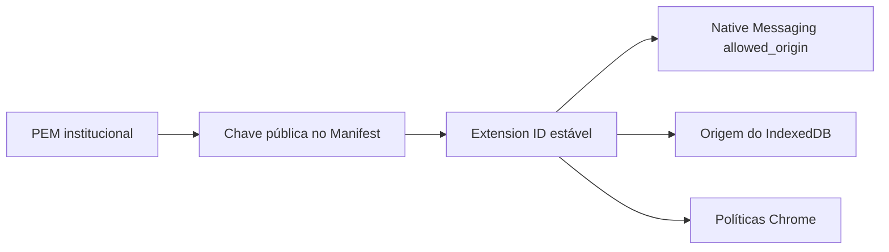

# Atualização e continuidade — Régua Editorial SieDOE

Este documento define os requisitos técnicos para atualizar a Régua Editorial sem perder identidade, dados locais ou capacidade de rollback.

## 1. Invariantes da atualização

Toda atualização deve preservar:

```text
Extension ID: chdfbekdjpecdajbpdelmhpemenoelmd
Native host:  com.egba.regua_editorial.helper
```

Também devem ser preservados:

- a PEM institucional da extensão;
- compatibilidade do Native Messaging;
- migração controlada do IndexedDB;
- políticas Chrome sem apagar entradas de terceiros;
- dados locais do perfil;
- pacote anterior para rollback.

## 2. Versionamento

A versão da extensão deve aumentar monotonicamente.

Exemplo:

```text
0.7.4 → 0.7.5 → 0.8.0
```

Evite depender de downgrade direto do Chrome. Para reversão funcional, publique versão numericamente superior contendo o comportamento aprovado anterior.

## 3. Cadeia de identidade



A perda ou troca da PEM rompe essa cadeia.

## 4. Build de nova versão

Antes de publicar:

1. atualizar versão e regras quando aplicável;
2. executar testes automatizados;
3. gerar CRX com a PEM institucional;
4. validar Extension ID;
5. gerar `update.xml`;
6. gerar Setup corporativo;
7. gerar Setup de homologação local quando necessário;
8. validar hashes e assinaturas;
9. executar QA dos artefatos;
10. testar instalação/upgrade em estação representativa.

## 5. Publicação da Release

Cada Release deve ser imutável do ponto de vista de rastreabilidade.

Recomendações:

- tag própria;
- notas de release;
- `.exe` e `.sha256` de cada artefato;
- inventário com tamanhos/hashes;
- versão anterior preservada;
- não substituir binário já homologado por rebuild silencioso.

Quando for indispensável substituir ativo numa pré-release, registre explicitamente o motivo e invalide o hash anterior.

## 6. Piloto local `file://`

A linha standalone atual instala CRX e `update.xml` no cache local:

```text
%ProgramData%\EGBA\ReguaEditorial\extension-cache\<versão>\
```

A política Chrome aponta para `file://` gerado a partir desse cache.

Vantagens no piloto:

- instalação sem Chrome Web Store;
- sem servidor web inicial;
- pacote autocontido.

Limitações:

- atualização depende de novo Setup/reparo/distribuição;
- gestão centralizada é menor do que em canal HTTPS corporativo.

## 7. Migração para HTTPS corporativo

Objetivo:

```text
https://<host>/regua-editorial/<canal>/update.xml
https://<host>/regua-editorial/<canal>/regua-editorial-<versão>.crx
```

Passos:

1. provisionar HTTPS corporativo;
2. publicar CRX assinado com a mesma PEM;
3. publicar `update.xml` com o mesmo Extension ID;
4. validar acesso das estações;
5. alterar política em grupo piloto;
6. confirmar que Chrome reconhece como atualização da mesma extensão;
7. conferir IndexedDB antes/depois;
8. ampliar gradualmente.

## 8. Estrutura sugerida do servidor de atualização

```text
/regua-editorial/
├── pilot/
│   ├── update.xml
│   ├── regua-editorial-0.7.4.crx
│   └── ...
└── stable/
    ├── update.xml
    └── regua-editorial-<versão>.crx
```

O canal `stable` deve ser promovido somente após homologação.

## 9. `update.xml`

Deve referenciar:

- Extension ID operacional;
- versão publicada;
- URL HTTPS do CRX correspondente.

Erros em ID, versão ou codebase devem bloquear a promoção.

## 10. Compatibilidade do Helper

Ao alterar a extensão, avalie:

- versão mínima/máxima do Helper;
- versão do contrato Native Messaging;
- novos tipos de mensagem;
- campos obrigatórios;
- comportamento de timeout/cancelamento;
- compatibilidade com instalação existente.

Se o contrato mudar, documente a matriz de compatibilidade.

## 11. IndexedDB

Mudança de schema exige:

- migração determinística;
- testes com base existente;
- rollback lógico quando possível;
- preservação de registros;
- validação de consultas/relatórios após upgrade.

Nunca trate limpeza de IndexedDB como mecanismo normal de atualização.

## 12. Dados antes e depois

Em amostra representativa, registre:

- número de cálculos;
- período dos registros;
- totais agregados;
- consultas representativas;
- exportação CSV/JSON.

Compare antes e depois da atualização.

## 13. Atualização via AD/GPO

Fluxo:

```text
nova Release
→ validação
→ pasta de versão no compartilhamento
→ grupo piloto
→ Setup /S
→ validação técnica
→ homologação funcional
→ expansão
```

Não sobrescreva a pasta da versão anterior no compartilhamento.

## 14. Reparo como mecanismo de migração

A migração do bootstrap local para HTTPS pode utilizar reparo/Setup atualizado desde que:

- o Extension ID não mude;
- a política final seja validada;
- o cache/estado sejam coerentes;
- IndexedDB seja preservado;
- o Chrome seja reiniciado.

## 15. Rollback

Estratégias em ordem de preferência:

1. suspender novas instalações;
2. reparar estação;
3. conter fluxo afetado;
4. publicar versão superior com comportamento anterior;
5. remover integralmente apenas como último recurso.

Consulte [04 — Plano de rollback](04-PLANO-DE-ROLLBACK.md).

## 16. Rotação de certificado de código

Trocar o certificado Authenticode do Setup/Helper é diferente de trocar a PEM da extensão.

A rotação de certificado de código pode ser planejada sem mudar Extension ID, desde que:

- novo certificado seja confiável;
- cadeia de assinatura seja validada;
- políticas de EDR permitam o novo signer;
- artefatos sejam re-homologados.

## 17. Rotação da PEM da extensão

É evento excepcional e potencialmente disruptivo.

Efeitos:

- novo Extension ID;
- nova origem Native Messaging;
- novo espaço lógico para armazenamento;
- necessidade de migração de dados/políticas.

Não execute sem plano formal de migração.

## 18. Promoção pilot → stable

Requisitos mínimos:

- assinatura corporativa reconhecida;
- build reprodutível e QA aprovado;
- piloto em lote representativo;
- EDR validado;
- política de atualização corporativa definida;
- rollback testado;
- documentação atualizada;
- aceite GERDO/TI;
- inventário fechado.

## 19. Evidências de cada atualização

Arquivar:

- tag/release;
- baseline de código registrada no manifesto;
- versão da extensão;
- versão do Helper/contrato;
- hashes;
- assinatura/thumbprint;
- QA;
- resultado do piloto;
- lista/quantidade de estações atingidas;
- incidentes e decisão de promoção.
