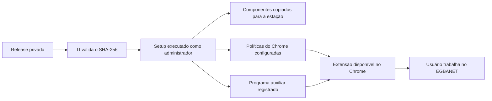

# Arquitetura de distribuição

Este documento explica como a Régua Editorial é empacotada, instalada e mantida nas estações. Ele se destina à TI, ao suporte de segundo nível e à equipe de desenvolvimento.

## 1. Separação dos repositórios

```text
guedesle/calculadora-editorial
└── código-fonte, testes, regras, scripts de build e engenharia

guedesle/regua-municipios-a-vista
└── instaladores publicados, documentação operacional e registros de entrega
```

A separação evita que a equipe usuária precise acessar código-fonte ou ferramentas de desenvolvimento para instalar a aplicação.

O repositório de distribuição não deve receber:

- código-fonte da aplicação;
- `node_modules` ou dependências de build;
- pastas intermediárias de compilação;
- chave privada usada para assinar a extensão;
- documentos ou dados reais de produção.

## 2. Pacote entregue

A Release contém:

```text
ReguaEditorial-Entrega1-Setup-x64.exe
ReguaEditorial-Entrega1-Setup-x64.exe.sha256
```

O `.exe` reúne todos os componentes necessários à instalação inicial. O `.sha256` permite confirmar que o arquivo não foi alterado.

## 3. Componentes instalados

| Componente | Papel |
|---|---|
| Extensão do Chrome | Exibe a interface e identifica os dados da matéria no EGBANET |
| Programa auxiliar do Windows | Converte DOC e RTF usando o Microsoft Word e executa operações locais autorizadas |
| Pacote local da extensão | Permite a instalação controlada sem Chrome Web Store |
| Políticas do Chrome | Mantêm a extensão instalada e autorizam sua comunicação local |
| Estado e logs administrativos | Registram a instalação e apoiam diagnóstico e reparo |

## 4. Fluxo de instalação



A instalação inicial não depende de servidor de atualização nem da Chrome Web Store. O pacote da extensão é disponibilizado localmente na estação.

## 5. Dependências da estação

Necessárias:

- Windows x64;
- Google Chrome;
- vínculo com o domínio corporativo;
- privilégio administrativo durante a instalação;
- Microsoft Word desktop somente para conversão automática de DOC e RTF.

Não são necessárias para o usuário:

- Node.js ou npm;
- Git;
- NSIS;
- SDK de desenvolvimento;
- instalação prévia do .NET Runtime;
- acesso ao repositório de código-fonte.

O programa auxiliar é publicado com os componentes necessários para executar sem instalação separada do runtime.

## 6. Identidade da extensão

```text
ID da extensão: chdfbekdjpecdajbpdelmhpemenoelmd
Programa auxiliar: com.egba.regua_editorial.helper
```

O ID identifica a extensão para o Chrome e também define o espaço em que os cálculos são armazenados. Futuras atualizações devem manter a mesma chave institucional e o mesmo ID.

Trocar o ID faz o Chrome tratar a atualização como outra extensão, com outro armazenamento local.

## 7. Armazenamento dos cálculos

Os cálculos são guardados no banco interno do Chrome, associado ao perfil do usuário e ao ID da extensão.

Não existe banco de dados externo nesta entrega. Isso reduz dependências, mas exige cuidados:

- usar sempre o mesmo perfil do Chrome;
- evitar limpeza de dados do navegador;
- exportar relatórios conforme a rotina operacional;
- preservar o ID da extensão em atualizações;
- executar remoções de forma controlada.

## 8. Políticas do Chrome

A instalação usa políticas locais do Windows:

```text
HKLM\SOFTWARE\Policies\Google\Chrome\ExtensionInstallForcelist
HKLM\SOFTWARE\Policies\Google\Chrome\NativeMessagingAllowlist
HKLM\SOFTWARE\Policies\Google\Chrome\ExtensionSettings
```

Elas têm três funções:

- instalar a extensão de forma gerenciada;
- apontar para o pacote local ou para um canal de atualização autorizado;
- permitir a comunicação com o programa auxiliar do Windows.

As políticas podem ser consultadas em `chrome://policy`.

## 9. Diretórios instalados

```text
%ProgramFiles%\EGBA\ReguaEditorial\
%ProgramFiles%\EGBA\ReguaEditorialHelper\
%ProgramData%\EGBA\ReguaEditorial\extension-cache\
%ProgramData%\EGBA\ReguaEditorial\state\
%ProgramData%\EGBA\ReguaEditorial\Logs\
```

| Diretório | Conteúdo |
|---|---|
| `ReguaEditorial` | scripts administrativos e arquivos do pacote |
| `ReguaEditorialHelper` | programa auxiliar do Windows |
| `extension-cache` | extensão e manifesto local de atualização |
| `state` | estado usado para reparo e remoção segura |
| `Logs` | registros técnicos da instalação e manutenção |

## 10. Assinatura do piloto

A pré-release atual usa um certificado temporário de laboratório para assinar os componentes locais. O instalador adiciona o certificado público aos repositórios de confiança da estação.

Consequências:

- o primeiro aviso do Windows pode apresentar **Editor desconhecido**;
- a validação do SHA-256 é obrigatória;
- a distribuição deve permanecer restrita ao piloto;
- uma assinatura corporativa reconhecida é requisito para o canal estável;
- a retirada do certificado ao final do piloto deve usar o thumbprint exato da Release.

## 11. Atualizações

A atualização deve preservar:

- ID da extensão;
- chave institucional de assinatura;
- compatibilidade com o programa auxiliar;
- registros locais;
- versão anterior disponível para recuperação.

O modelo futuro pode usar endereço HTTPS corporativo para distribuir atualizações, sem trocar o ID da extensão.

## 12. Controles da distribuição

- repositório e Release privados;
- SHA-256 publicado com o instalador;
- chave privada fora do repositório e do pacote;
- promoção do piloto somente após homologação;
- logs sem conteúdo documental;
- pacote anterior preservado;
- inventário de versões e estações mantido pela equipe responsável.