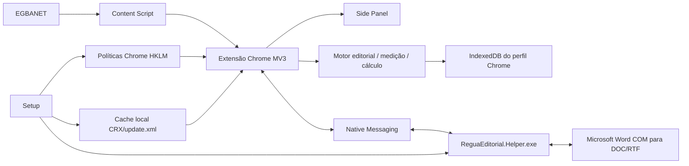

# Arquitetura de distribuição corporativa

Este documento descreve como a Régua Editorial SieDOE é empacotada, distribuída, instalada, atualizada e suportada em ambiente corporativo Windows/Chrome.

## 1. Separação de responsabilidades

```text
guedesle/calculadora-editorial
└── código-fonte, testes, regras editoriais, scripts de build e engenharia

guedesle/regua-municipios-a-vista
└── instaladores publicados em Releases, hashes, documentação e scripts de publicação
```

O repositório de distribuição não deve receber:

- código-fonte da aplicação;
- `node_modules` ou dependências de build;
- staging ou artefatos intermediários;
- PEM/PFX/chaves privadas;
- documentos ou dados reais de produção.

## 2. Componentes da Entrega 1.0.1

| Componente | Versão | Papel |
|---|---:|---|
| Extensão Chrome MV3 | `0.7.4` | UI, integração com EGBANET, processamento, cálculo, persistência e relatórios |
| Regras editoriais | `municipios-editorial-rules@1.3.0` | tipografia e geometria editorial homologadas |
| Native Helper | `0.1.4` | operações locais autorizadas e conversão DOC/RTF via Word |
| Contrato Native Messaging | `1.2.0` | protocolo entre extensão e Helper |
| IndexedDB/schema | `3` | persistência local dos cálculos |
| Setup | `1.0.1` | instalação, validação, políticas, reparo e remoção |

Identidade:

```text
Extension ID: chdfbekdjpecdajbpdelmhpemenoelmd
Native host:  com.egba.regua_editorial.helper
```

## 3. Dois artefatos de instalação

A mesma extensão e o mesmo Helper são distribuídos por dois Setups distintos.

### Corporativo

```text
ReguaEditorial-Entrega1-Corporativo-x64.exe
```

- destinado a estações do Active Directory;
- exige `PartOfDomain = True`;
- mantém todos os gates de ambiente corporativo;
- é o artefato institucional para rollout.

### Homologação local

```text
ReguaEditorial-Entrega1-HomologacaoLocal-x64.exe
```

- destinado a laboratório fora do domínio;
- registra no manifesto que é artefato de homologação local;
- ignora exclusivamente o gate de gerenciamento/AD;
- mantém integridade, assinatura, versão, Helper e políticas Chrome;
- não substitui o pacote corporativo.

Os dois instaladores devem ter SHA-256 diferentes e ser publicados junto de seus arquivos `.sha256`.

## 4. Arquitetura lógica



## 5. Superfície da extensão

Manifest V3 com:

- service worker de background em módulo;
- side panel;
- página de opções/relatórios aberta em aba;
- content script restrito às páginas de matéria;
- Native Messaging;
- armazenamento local.

Host permission:

```text
https://egbanet.egba.ba.gov.br/*
```

Content scripts:

```text
https://egbanet.egba.ba.gov.br/admin/materias/edit/*
https://egbanet.egba.ba.gov.br/admin/materias/edicao_restrita/*
```

Permissões declaradas:

```text
sidePanel
activeTab
tabs
downloads
downloads.open
storage
nativeMessaging
```

Consulte [11 — Especificação técnica da extensão](11-ESPECIFICACAO-TECNICA-EXTENSAO.md).

## 6. Identidade e atualização da extensão

A chave pública operacional está incorporada ao Manifest. A chave privada correspondente não faz parte do repositório ou do Setup.

A identidade deve ser preservada porque:

- o Chrome usa o ID para reconhecer a mesma extensão entre versões;
- o Native Messaging autoriza a origem por Extension ID;
- o IndexedDB está associado ao perfil e à origem da extensão;
- trocar o ID pode tornar os registros anteriores inacessíveis para a nova extensão.

Toda atualização deve reutilizar a mesma PEM institucional.

## 7. Native Messaging

O Helper é instalado em:

```text
%ProgramFiles%\EGBA\ReguaEditorialHelper\ReguaEditorial.Helper.exe
```

Manifesto do native host:

```text
%ProgramFiles%\EGBA\ReguaEditorialHelper\com.egba.regua_editorial.helper.json
```

Origem autorizada:

```text
chrome-extension://chdfbekdjpecdajbpdelmhpemenoelmd/
```

Registro por máquina:

```text
HKLM\Software\Google\Chrome\NativeMessagingHosts\com.egba.regua_editorial.helper
```

O instalador registra as visões 32 e 64 bits para compatibilidade.

## 8. Políticas Chrome

A instalação usa políticas de máquina:

```text
HKLM\SOFTWARE\Policies\Google\Chrome\ExtensionInstallForcelist
HKLM\SOFTWARE\Policies\Google\Chrome\NativeMessagingAllowlist
HKLM\SOFTWARE\Policies\Google\Chrome\ExtensionSettings
```

Funções:

- `ExtensionInstallForcelist`: força a instalação da extensão;
- `NativeMessagingAllowlist`: autoriza o host nativo;
- `ExtensionSettings`: define `force_installed`, `update_url` e override do endereço de atualização.

O script preserva entradas numeradas preexistentes que não pertencem à Régua e guarda o estado anterior necessário para reparo/remoção controlada.

## 9. Bootstrap e atualização

A instalação inicial standalone utiliza:

```text
CRX incorporado ao Setup
+
update.xml local
+
file:// em cache sob ProgramData
```

Isso permite instalar o piloto sem Chrome Web Store e sem servidor web inicial.

Arquitetura prevista para continuidade:

```text
piloto local file://
        ↓
HTTPS corporativo com o mesmo Extension ID
        ↓
canal stable assinado corporativamente
```

A migração para HTTPS deve alterar somente o canal de atualização, não a identidade da extensão.

## 10. Diretórios instalados

```text
%ProgramFiles%\EGBA\ReguaEditorial\
%ProgramFiles%\EGBA\ReguaEditorialHelper\
%ProgramData%\EGBA\ReguaEditorial\extension-cache\
%ProgramData%\EGBA\ReguaEditorial\state\
%ProgramData%\EGBA\ReguaEditorial\Logs\
```

| Diretório | Conteúdo |
|---|---|
| `ReguaEditorial` | scripts, manifestos, payloads e desinstalador |
| `ReguaEditorialHelper` | Helper e manifesto Native Messaging |
| `extension-cache` | CRX e `update.xml` local |
| `state` | `installation.json`, `chrome-policy.json` e estado de rollback |
| `Logs` | logs administrativos da instalação/manutenção |

## 11. Persistência de dados

Os cálculos ficam no IndexedDB do perfil Chrome. Não há banco externo nesta entrega.

A aplicação não deve persistir o conteúdo documental processado. O armazenamento funcional contém metadados do cálculo e dados necessários a consultas/relatórios.

Implicações de suporte:

- preservar o mesmo perfil Chrome;
- preservar o Extension ID;
- não limpar dados do navegador sem procedimento de exportação;
- não remover a extensão como ação de troubleshooting rotineira.

## 12. Assinatura e integridade

O piloto utiliza certificado temporário de laboratório para assinatura dos componentes e Setup.

Controles:

- `.sha256` publicado para cada instalador;
- validação de hashes internos do pacote;
- validação Authenticode dos componentes;
- certificado público incorporado ao Setup;
- chave privada fora da distribuição;
- canal stable condicionado a certificado corporativo reconhecido.

## 13. Distribuição em Active Directory

O Setup NSIS pode ser executado interativamente ou silenciosamente (`/S`). Para rollout corporativo:

- use grupo/OU piloto;
- copie o `.exe` para disco local;
- valide hash antes da execução;
- execute como SYSTEM ou administrador;
- reinicie/reabra o Chrome;
- valide políticas e extensão;
- amplie em ondas somente após telemetria/evidência do lote anterior.

Consulte [12 — Distribuição corporativa AD/GPO](12-DISTRIBUICAO-CORPORATIVA-AD-GPO.md).

## 14. Controles de distribuição

- repositório privado;
- Releases privadas;
- dois artefatos explicitamente nomeados;
- hashes independentes;
- PEM fora do repositório;
- QA automatizado antes da publicação;
- homologação funcional antes da ampliação;
- pacote anterior preservado;
- rollback documentado;
- logs sem conteúdo documental;
- inventário de versão e estações mantido pela TI.
