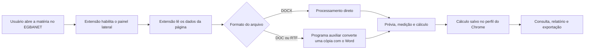

# Referência técnica

Use este documento para suporte de segundo nível, diagnóstico, manutenção e atualização da Régua Editorial.

## 1. Visão técnica

| Componente | Papel na solução | Versão |
|---|---|---|
| Extensão do Chrome | Abre o painel lateral, lê a página da matéria, processa documentos, calcula, consulta e gera relatórios | `0.7.3` |
| Programa auxiliar do Windows | Converte DOC e RTF com o Microsoft Word e executa operações locais autorizadas | `0.1.4` |
| Comunicação local | Canal protegido entre a extensão e o programa auxiliar | `1.2.0` |
| Armazenamento local | Banco interno do Chrome usado para guardar cálculos | schema `3` |
| Instalador | Copia os componentes e configura a estação | `1.0.0` |

Identificadores:

```text
ID da extensão:              chdfbekdjpecdajbpdelmhpemenoelmd
Programa auxiliar registrado: com.egba.regua_editorial.helper
```

## 2. Páginas compatíveis

O painel lateral é habilitado somente nestes padrões do EGBANET:

```text
https://egbanet.egba.ba.gov.br/admin/materias/edit/{id_materia}
https://egbanet.egba.ba.gov.br/admin/materias/edicao_restrita/{id_materia}
```

Em uma página compatível, clicar no ícone da extensão abre o painel lateral. Em outras páginas, a ação permanece desabilitada.

## 3. Fluxo de funcionamento



Se o programa auxiliar estiver indisponível, o fluxo de DOC e RTF deve apresentar diagnóstico ou orientação de conversão. DOCX não depende do Word.

## 4. Diretórios instalados

```text
%ProgramFiles%\EGBA\ReguaEditorial\
%ProgramFiles%\EGBA\ReguaEditorialHelper\
%ProgramData%\EGBA\ReguaEditorial\extension-cache\
%ProgramData%\EGBA\ReguaEditorial\state\
%ProgramData%\EGBA\ReguaEditorial\Logs\
```

| Diretório | Finalidade |
|---|---|
| `ReguaEditorial` | scripts administrativos, manifestos e desinstalador |
| `ReguaEditorialHelper` | programa auxiliar e arquivos necessários à execução |
| `extension-cache` | pacote local da extensão e manifesto de atualização |
| `state` | estado usado para reparar e remover sem sobrescrever políticas alheias |
| `Logs` | registros administrativos sanitizados |

## 5. Políticas do Chrome

A instalação gerenciada usa:

```text
HKLM\SOFTWARE\Policies\Google\Chrome\ExtensionInstallForcelist
HKLM\SOFTWARE\Policies\Google\Chrome\NativeMessagingAllowlist
HKLM\SOFTWARE\Policies\Google\Chrome\ExtensionSettings
```

Funções:

- `ExtensionInstallForcelist`: mantém a extensão instalada;
- `NativeMessagingAllowlist`: autoriza o programa auxiliar;
- `ExtensionSettings`: define o modo de instalação e o endereço de atualização.

Consulte no navegador:

```text
chrome://policy
chrome://extensions
```

A extensão deve aparecer com o ID esperado e como gerenciada pela organização.

## 6. Diagnóstico rápido da estação

### Domínio corporativo

```powershell
Get-CimInstance Win32_ComputerSystem |
  Select-Object PartOfDomain, Domain
```

Resultado esperado: `PartOfDomain = True`.

### Chrome instalado

```powershell
$candidates = @(
  "$env:ProgramFiles\Google\Chrome\Application\chrome.exe",
  "${env:ProgramFiles(x86)}\Google\Chrome\Application\chrome.exe",
  "$env:LOCALAPPDATA\Google\Chrome\Application\chrome.exe"
)

$candidates | Where-Object { $_ -and (Test-Path $_ -PathType Leaf) }
```

### Programa auxiliar

```powershell
& "$env:ProgramFiles\EGBA\ReguaEditorialHelper\ReguaEditorial.Helper.exe" `
  --probe `
  --workspace "$env:TEMP"
```

Confirme:

- `helperVersion` igual a `0.1.4`;
- `contractVersion` igual a `1.2.0`;
- pasta temporária gravável;
- Word detectado, quando instalado.

### Arquivos instalados

```powershell
Test-Path "$env:ProgramFiles\EGBA\ReguaEditorial"
Test-Path "$env:ProgramFiles\EGBA\ReguaEditorialHelper\ReguaEditorial.Helper.exe"
Test-Path "$env:ProgramData\EGBA\ReguaEditorial\extension-cache"
Test-Path "$env:ProgramData\EGBA\ReguaEditorial\state"
Test-Path "$env:ProgramData\EGBA\ReguaEditorial\Logs"
```

## 7. Certificado temporário do piloto

O instalador piloto usa certificado autossinado e adiciona sua parte pública aos repositórios do computador:

```text
Cert:\LocalMachine\Root
Cert:\LocalMachine\TrustedPublisher
```

O primeiro UAC pode mostrar **Editor desconhecido**, pois o certificado ainda não está confiado antes da execução inicial.

Liste certificados relacionados:

```powershell
Get-ChildItem Cert:\LocalMachine\Root, Cert:\LocalMachine\TrustedPublisher |
  Where-Object { $_.Subject -eq 'CN=Empresa Grafica da Bahia' } |
  Select-Object Subject, Thumbprint, NotAfter, PSParentPath
```

Não remova certificados apenas pelo nome. Compare o thumbprint com o manifesto da instalação e confirme que nenhuma estação ativa depende dele.

A assinatura corporativa reconhecida é requisito para promover a distribuição ao canal estável.

## 8. Logs e evidências

Local padrão:

```text
%ProgramData%\EGBA\ReguaEditorial\Logs\
```

Logs permitidos:

- versão dos componentes;
- resultado do diagnóstico;
- hash do instalador;
- código e horário do erro;
- estado da instalação;
- duração das operações.

Não coletar:

- conteúdo da matéria;
- protocolo, cliente ou ID real da matéria;
- cookies, tokens ou senhas;
- documentos de produção;
- conteúdo integral do armazenamento local.

## 9. Armazenamento dos cálculos

Os cálculos ficam no IndexedDB, o banco interno do Chrome. O armazenamento está associado ao:

- perfil do usuário;
- ID da extensão;
- estado da extensão nesse perfil.

Consequências:

- outro perfil não verá os mesmos cálculos;
- limpar dados do navegador pode remover registros;
- trocar o ID cria outro armazenamento;
- remover a extensão pode eliminar os dados.

Antes de ação invasiva:

1. exporte JSON e CSV;
2. registre quantidade, período e totais;
3. confirme o perfil do Chrome;
4. obtenha autorização quando houver risco de descarte.

## 10. Microsoft Word e conversão

O Word é utilizado somente para DOC e RTF.

Verifique:

- Word desktop instalado;
- licença ativa;
- Word aberto manualmente ao menos uma vez no perfil do usuário;
- ausência de caixa de diálogo pendente;
- diagnóstico do programa auxiliar aprovado;
- teste com arquivo sintético, sem macro.

O programa auxiliar deve abrir uma cópia como somente leitura, desabilitar macros e produzir um DOCX válido. O original não deve ser substituído.

Quando o painel solicitar conversão manual apesar de o programa auxiliar estar instalado, trate como possível falha de comunicação e registre a ocorrência.

## 11. Reparação

Antes do reparo, registre versão e quantidade de cálculos.

Depois do reparo, confirme:

1. diretórios instalados;
2. políticas em `chrome://policy`;
3. extensão em `chrome://extensions`;
4. resposta do programa auxiliar;
5. funcionamento de DOCX;
6. conversão de DOC/RTF, quando aplicável;
7. preservação dos cálculos.

O reparo não deve trocar o ID nem apagar o armazenamento local.

## 12. Remoção

### Remoção padrão

O desinstalador padrão:

- remove o programa auxiliar;
- remove sua autorização de comunicação;
- preserva a política da extensão;
- preserva o pacote local e os cálculos;
- pode manter DOCX, consultas e relatórios disponíveis;
- desabilita a conversão automática de DOC e RTF.

### Remoção integral

A remoção também da extensão exige a confirmação literal:

```text
EXPORTED_OR_DISCARD_AUTHORIZED
```

Use somente depois de exportar os registros ou obter autorização expressa para descarte. Consulte o [Plano de reversão](04-PLANO-DE-ROLLBACK.md).

A remoção padrão não deve ser interpretada como retirada automática do certificado temporário do piloto.

## 13. Atualização

Toda atualização deve preservar:

- a mesma chave institucional da extensão;
- o ID `chdfbekdjpecdajbpdelmhpemenoelmd`;
- compatibilidade entre extensão e programa auxiliar;
- migração controlada do armazenamento;
- versão anterior disponível para recuperação.

Teste primeiro no canal piloto. A promoção para o canal estável depende de homologação e assinatura corporativa reconhecida.

## 14. Sintomas e hipóteses iniciais

| Sintoma ou código | Hipótese inicial |
|---|---|
| `ACTIVE_DIRECTORY_REQUIRED` | estação não reconhecida como vinculada ao domínio |
| ícone desabilitado | página fora dos endereços compatíveis |
| painel não abre em página compatível | extensão não carregada, política pendente ou service worker com falha |
| extensão ausente | política não aplicada ou instalação incompleta |
| ID divergente | pacote incorreto ou identidade alterada |
| programa auxiliar não localizado | instalação incompleta ou registro local ausente |
| Word não detectado | Word ausente, não inicializado ou indisponível no perfil |
| conversão manual solicitada com helper instalado | possível falha na comunicação local ou fluxo incompatível |
| registros ausentes | perfil diferente, limpeza de dados ou ID alterado |
| DOCX funciona e DOC/RTF falha | problema concentrado no Word ou no programa auxiliar |

## 15. Identificação da Release

```text
Release:          v1.0.0-pilot.1
Instalador:       1.0.0
Extensão:         0.7.3
Programa auxiliar: 0.1.4
Comunicação:      1.2.0
Schema local:     3
Canal:            pilot
```