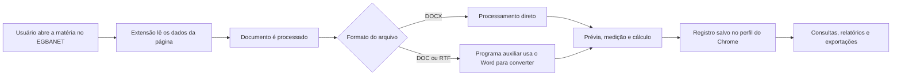

# Referência técnica

Este documento reúne informações para suporte de segundo nível, diagnóstico, manutenção e atualização da Régua Editorial.

## 1. Componentes

| Componente | Papel na solução | Versão |
|---|---|---|
| Extensão do Chrome | Interface do usuário, leitura da página do EGBANET, cálculo, consultas e relatórios | `0.7.3` |
| Programa auxiliar do Windows | Conversão de DOC e RTF com o Microsoft Word e operações locais protegidas | `0.1.4` |
| Comunicação local | Canal autorizado entre a extensão e o programa auxiliar | `1.2.0` |
| Armazenamento local | Banco interno do Chrome usado para guardar cálculos e relatórios | schema `3` |
| Instalador | Copia os componentes e configura o Chrome na estação | `1.0.0` |

Identificadores operacionais:

```text
Extension ID: chdfbekdjpecdajbpdelmhpemenoelmd
Native host:  com.egba.regua_editorial.helper
```

## 2. Fluxo de funcionamento



## 3. Diretórios instalados

```text
%ProgramFiles%\EGBA\ReguaEditorial\
%ProgramFiles%\EGBA\ReguaEditorialHelper\
%ProgramData%\EGBA\ReguaEditorial\extension-cache\
%ProgramData%\EGBA\ReguaEditorial\state\
%ProgramData%\EGBA\ReguaEditorial\Logs\
```

Finalidades:

- `ReguaEditorial`: scripts administrativos e arquivos da instalação;
- `ReguaEditorialHelper`: executável do programa auxiliar;
- `extension-cache`: pacote da extensão distribuído ao Chrome;
- `state`: estado administrativo da instalação;
- `Logs`: registros técnicos sanitizados.

## 4. Políticas do Chrome

A instalação gerenciada utiliza políticas locais do Windows para disponibilizar a extensão e autorizar sua comunicação com o programa auxiliar.

Locais principais:

```text
HKLM\SOFTWARE\Policies\Google\Chrome\ExtensionInstallForcelist
HKLM\SOFTWARE\Policies\Google\Chrome\NativeMessagingAllowlist
HKLM\SOFTWARE\Policies\Google\Chrome\ExtensionSettings
```

Verificações no navegador:

```text
chrome://policy
chrome://extensions
```

A extensão deve aparecer com o ID operacional e como gerenciada pela organização.

## 5. Diagnóstico da estação

### Domínio corporativo

```powershell
Get-CimInstance Win32_ComputerSystem |
  Select-Object PartOfDomain, Domain
```

### Chrome instalado

```powershell
$candidates = @(
  "$env:ProgramFiles\Google\Chrome\Application\chrome.exe",
  "${env:ProgramFiles(x86)}\Google\Chrome\Application\chrome.exe",
  "$env:LOCALAPPDATA\Google\Chrome\Application\chrome.exe"
)

$candidates | Where-Object { Test-Path $_ }
```

### Programa auxiliar

```powershell
& "$env:ProgramFiles\EGBA\ReguaEditorialHelper\ReguaEditorial.Helper.exe" `
  --probe `
  --workspace "$env:TEMP"
```

O diagnóstico deve confirmar versão, compatibilidade de comunicação, acesso à pasta temporária e disponibilidade do Word.

### Arquivos instalados

```powershell
Get-ChildItem "$env:ProgramFiles\EGBA\ReguaEditorial" -Recurse
Get-ChildItem "$env:ProgramFiles\EGBA\ReguaEditorialHelper" -Recurse
Get-ChildItem "$env:ProgramData\EGBA\ReguaEditorial" -Recurse
```

## 6. Logs e evidências

Local padrão:

```text
%ProgramData%\EGBA\ReguaEditorial\Logs\
```

Podem ser coletados:

- versão dos componentes;
- resultado do diagnóstico;
- hash do instalador;
- código e horário do erro;
- estado da instalação;
- duração das operações.

Não devem ser coletados:

- conteúdo da matéria;
- protocolo ou cliente real;
- cookies, tokens ou senhas;
- arquivos de produção;
- conteúdo completo do armazenamento local.

## 7. Armazenamento dos cálculos

Os cálculos são mantidos no IndexedDB, banco interno do Chrome associado simultaneamente ao:

- perfil do usuário;
- ID da extensão;
- instalação da extensão.

Consequências práticas:

- outro perfil do Chrome não verá os mesmos registros;
- limpar os dados do navegador pode remover os cálculos;
- trocar o ID da extensão cria outro espaço de armazenamento;
- remover integralmente a extensão pode eliminar os dados locais.

Antes de manutenção invasiva, exporte JSON e CSV e registre a quantidade de cálculos.

## 8. Compatibilidade com Microsoft Word

O Word é usado apenas na conversão de DOC e RTF. Para diagnóstico:

- confirmar que o Word desktop está instalado;
- confirmar que a licença está ativa;
- abrir o Word manualmente ao menos uma vez no perfil do usuário;
- verificar se não há caixa de diálogo pendente;
- executar o diagnóstico do programa auxiliar;
- testar com arquivo sintético, sem macro e sem conteúdo de produção.

DOCX não depende dessa conversão.

## 9. Reparação

Use primeiro o reparo do instalador. Depois confirme:

1. arquivos em `%ProgramFiles%`;
2. políticas em `chrome://policy`;
3. extensão em `chrome://extensions`;
4. resposta do programa auxiliar;
5. funcionamento de DOCX;
6. persistência dos registros existentes.

O reparo não deve trocar o ID da extensão nem apagar o armazenamento local.

## 10. Atualização

Toda nova versão deve preservar:

- a mesma chave institucional usada para assinar a extensão;
- o ID `chdfbekdjpecdajbpdelmhpemenoelmd`;
- compatibilidade entre extensão e programa auxiliar;
- migração controlada do armazenamento local;
- pacote anterior disponível para recuperação.

A atualização deve ser validada primeiro no canal piloto e somente depois promovida para uso ampliado.

## 11. Remoção e reversão

A remoção padrão deve priorizar a retirada do programa auxiliar e dos componentes administrativos, preservando os dados até decisão expressa.

A retirada da política da extensão ou a limpeza do perfil do Chrome é uma ação destrutiva em potencial. Antes disso:

1. exportar os cálculos;
2. registrar contagens e totais;
3. obter autorização;
4. seguir o [Plano de rollback](04-PLANO-DE-ROLLBACK.md).

## 12. Códigos e sintomas importantes

| Sintoma ou código | Interpretação inicial |
|---|---|
| `ACTIVE_DIRECTORY_REQUIRED` | Estação não reconhecida como pertencente ao domínio |
| Extensão ausente | Chrome não recarregou a política ou instalação incompleta |
| ID divergente | Pacote incorreto ou identidade operacional alterada |
| Programa auxiliar não localizado | Instalação incompleta ou registro local ausente |
| Word não detectado | Word ausente, não inicializado ou indisponível no perfil |
| Registros ausentes | Perfil diferente, dados limpos ou ID da extensão alterado |
| Conversão falha e DOCX funciona | Problema concentrado no Word ou no programa auxiliar |

## 13. Informações da Release

```text
Release:       v1.0.0-pilot.1
Instalador:    1.0.0
Extensão:      0.7.3
Programa local: 0.1.4
Comunicação:   1.2.0
Schema local:  3
Canal:         pilot
```