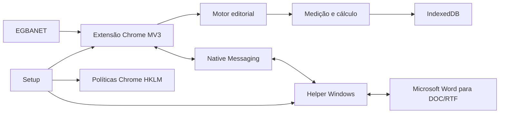

# Referência técnica

Esta seção é para TI, suporte de segundo nível, arquitetura e segurança.

## Componentes



| Componente | Versão |
|---|---|
| Setup | `1.0.1` |
| Extensão | `0.7.4` |
| Regras editoriais | `municipios-editorial-rules@1.3.0` |
| Helper | `0.1.4` |
| Contrato Native Messaging | `1.2.0` |
| IndexedDB | schema `3` |

## Identidades

```text
Extension ID: chdfbekdjpecdajbpdelmhpemenoelmd
Native host:  com.egba.regua_editorial.helper
```

## Caminhos instalados

```text
%ProgramFiles%\EGBA\ReguaEditorial\
%ProgramFiles%\EGBA\ReguaEditorialHelper\
%ProgramData%\EGBA\ReguaEditorial\extension-cache\
%ProgramData%\EGBA\ReguaEditorial\state\
%ProgramData%\EGBA\ReguaEditorial\Logs\
```

## Políticas Chrome

```text
HKLM\SOFTWARE\Policies\Google\Chrome\ExtensionInstallForcelist
HKLM\SOFTWARE\Policies\Google\Chrome\NativeMessagingAllowlist
HKLM\SOFTWARE\Policies\Google\Chrome\ExtensionSettings
```

Native Messaging:

```text
HKLM\Software\Google\Chrome\NativeMessagingHosts\com.egba.regua_editorial.helper
```

## Aprofundamento

- [Extensão Chrome / Manifest V3](EXTENSAO-MV3.md)
- [Segurança, permissões e identidade](SEGURANCA-E-IDENTIDADE.md)
- [Atualização e rollback](ATUALIZACAO-E-ROLLBACK.md)
- [Motor de transformação editorial](../motor/ESPECIFICACAO.md)
- [Distribuição AD/GPO](../instalacao/AD-GPO.md)

O código-fonte e os testes permanecem no repositório de desenvolvimento; este repositório contém somente o necessário para distribuição, implantação, operação e auditoria.